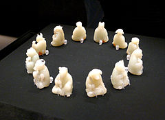

README Document
=====================================================

**This is the README Document for the Chinese Zodiac Calculator.** The Definition and Signs of Chinese Zodiac comes from [Wikipedia](http://en.wikipedia.org/wiki/Chinese_zodiac "Chinese zodiac - Wikipedia").   
   
  
    
## What is Chinese Zodiac? ##  

The Sh¨¥ngxi¨¤o, literally "birth likeness", is also known in English as the Chinese zodiac. Zodiac derives from the similar concept in western astrology and means "circle of animals". The Chinese zodiac is a scheme and systematic plan of future action that relates each year to an animal and its reputed attributes according to a 12-year cycle, and it remains popular in several East Asian countries including China, Vietnam, Korea and Japan.  
Identifying this scheme using the term "zodiac" reflects several similarities to the western zodiac: both have time cycles divided into 12 parts, each labels at least the majority of those parts with names of animals, and each is widely associated with a culture of ascribing a person's personality or events in his or her life to the supposed influence of the person's particular relationship to the cycle. Nevertheless, there are major differences: the Chinese 12-part cycle corresponds to years, rather than months. The Chinese zodiac is represented by 12 animals, whereas some of the signs in the Western zodiac are not animals, despite the implication of the Greek etymology of "zodiac". The animals of the Chinese zodiac are not associated with constellations, let alone those spanned by the ecliptic plane.

## 12 Chinese Zodiac Signs ##
The zodiac traditionally begins with the sign of the Rat. The following are the twelve zodiac signs (each with its associated Earthly Branch) in order and their characteristics.[1]

    Rat ¨C Êó (×Ó) (Yang, 1st Trine, Fixed Element Water)
    Ox ¨C Å£ (³ó) (Yin, 2nd Trine, Fixed Element Water)
    Tiger ¨C »¢ (Òú) (Yang, 3rd Trine, Fixed Element Wood)
    Rabbit ¨C Íà or ƒ· (î) (Yin, 4th Trine, Fixed Element Wood)
    Dragon ¨C ýˆ / Áú (³½) (Yang, 1st Trine, Fixed Element Wood)
    Snake ¨C Éß (ËÈ) (Yin, 2nd Trine, Fixed Element Fire)
    Horse ¨C ñR / Âí (Îç) (Yang, 3rd Trine, Fixed Element Fire)
    Goat ¨C Ñò (δ) (Yin, 4th Trine, Fixed Element Fire)
    Monkey ¨C ºï (Éê) (Yang, 1st Trine, Fixed Element Metal)
    Rooster ¨C ëu / ¼¦ (ÓÏ) (Yin, 2nd Trine, Fixed Element Metal)
    Dog ¨C ¹· / È® (Ðç) (Yang, 3rd Trine, Fixed Element Metal)
    Pig ¨C Øi / Öí (º¥) (Yin, 4th Trine, Fixed Element Water)

In Chinese astrology the animal signs assigned by year represent what others perceive you as being or how you present yourself. It is a common misconception that the animals assigned by year are the only signs and many western descriptions of Chinese astrology draw solely on this system. In fact, there are also animal signs assigned by month (called inner animals), by day (called true animals) and hours (called secret animals).

While a person might appear to be a Dragon because they were born in the year of the Dragon, they might also be a Snake internally, an Ox truly, and a Goat secretively.

Depending on the source, the Goat is sometimes interchangeable with a Sheep or Ram.  
  
## How to Use? ##
1. Type your birth date on the sidebar.  
  
  
  
2. Click "Submit"  
3. The Right Side(mainPanel) will Return your Birthday, Birth year and your Chinese Zodiac on a Geogerian Calendar basis.  

## Caution ##
If you want to calculate the exact Chinese Zodiac, please Google Geogerian Calendar Chinese Lunar Calendar Converter then type the converted lunar birth date in the sidebar.   
Actually, the calculation of Chinese Zodiac is based on the Chinese Lunar 
Calender, which need a sophisticated transformation. But in today's China, calculating 
Chinese Zodiac is also okay on a Gregorian Calender basis. So in this mini-app, I 
calculated the Chinese Zodiac with Gregorian Calendar.